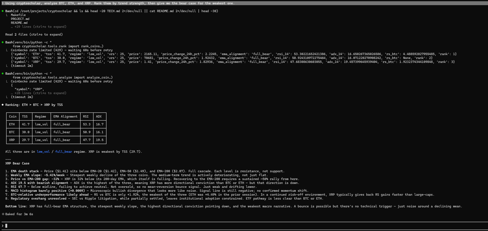
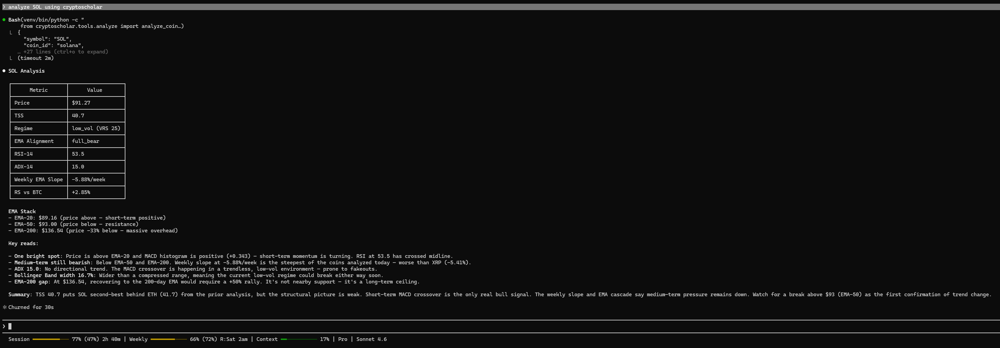

# CryptoScholar

> **Crypto technical analysis, directly inside Claude.** CryptoScholar is a Model Context Protocol (MCP) server that gives Claude real-time TA capabilities — no chart-switching, no copy-pasting data, no context loss.

Ask Claude *"Is SOL set up for a swing trade?"* and it fetches live data from Binance, runs a full indicator suite, scores it, and delivers a grounded bull/bear debate — all in one response.

---

## What it does

CryptoScholar exposes 14 MCP tools that Claude can call natively:

### `analyze_coin`
Full technical analysis snapshot for any coin. Fetches 300 days of real OHLCV candles from Binance (with CoinGecko fallback) and computes:

| Indicator | Details |
|-----------|---------|
| **Trend** | EMA-20, EMA-50, EMA-200 alignment + weekly EMA slope |
| **Momentum** | RSI-14, MACD (line / signal / histogram), ADX-14 |
| **Volatility** | ATR-14, Bollinger Band width, Historical Volatility (20-day annualised) |
| **Relative Strength** | Coin vs BTC (20-day ratio change) |
| **Multi-timeframe** | 4H EMA alignment — ±3 TSS bonus/penalty based on 4H EMA-20 vs EMA-50 |
| **RSI Divergence** | Bullish / bearish / none — price vs RSI extremes over last 30 bars |
| **OBV Trend** | On-Balance Volume direction (rising / falling / flat) — ±2 TSS confirmation bonus |
| **Funding Rate** | Current USDT-M perpetual funding rate — positive extremes = over-leveraged longs |
| **Regime** | Low / mid / high volatility — classified by 3-state GaussianHMM (falls back to rule-based) |
| **TSS** | Trend Strength Score — 0–100 composite (40% trend + 30% momentum + 30% RS ± MTF ± OBV) |

### `rank_coins`
Pass a list of symbols and get them back ranked by TSS. Runs in parallel (up to 8 workers) for fast results on large lists. Each result includes TSS, regime, EMA alignment, 4H MTF alignment, RSI divergence, OBV trend, funding rate, RSI-14, ADX-14, and RS vs BTC.

### `top_coins`
No symbol list needed. Fetches the top 50 coins by market cap from CoinGecko and returns them ranked by TSS. Smart filtering automatically removes:
- Stablecoins (USDT, USDC, DAI, etc.)
- Wrapped / synthetic tokens (WBTC, WETH, stETH, cbBTC, etc.)
- Low-liquidity coins with < $10M daily volume

### `correlate_coins`
Compute pairwise Pearson correlation of 30-day daily returns across 2–20 coins. Returns the full correlation matrix, high-correlation clusters (>0.85), and uncorrelated pairs (<0.30) — useful for portfolio diversification analysis.

### `market_context`
Macro market signals to frame individual coin analysis. Uses CoinGecko global data, DefiLlama stablecoin supply, and Alternative.me Fear & Greed Index. Returns:

| Signal | Description |
|--------|-------------|
| **BTC dominance** | Current % and 30-day change — falling = capital rotating to alts |
| **ETH/BTC ratio** | 20-day trend — rising = broadening rally |
| **TOTAL3** | Altcoin market cap (ex-BTC, ex-ETH) 30-day change |
| **Stablecoin supply** | Total stablecoin market cap and 30-day trend (rising = more buying power) |
| **Fear & Greed** | Alternative.me index (0–100) — extreme fear/greed applies ±5 modifier to MRS |
| **ARS** | Altcoin Rotation Score 0–100 — how favourable macro is for alts |
| **MRS** | Market Readiness Score 0–100 — overall market readiness for upside moves |

### `debate`
Claude reads the live TA data and generates a structured bull/bear debate grounded in actual indicator values — not hallucinated opinion. Returns:
- **Bull case** — what the technicals say in favour
- **Bear case** — what could go wrong
- **Bottom line** — one-sentence synthesis

### Watchlist tools
Persistent coin lists stored in SQLite (`~/.cryptoscholar/watchlist.db`).

| Tool | What it does |
|------|-------------|
| `watchlist_add` | Add symbols to a named list (creates the list if needed) |
| `watchlist_remove` | Remove symbols; also clears their alerts |
| `watchlist_show` | Show all symbols + configured alerts for a list |
| `watchlist_lists` | List all named watchlists with symbol counts |
| `watchlist_scan` | Run a full TSS analysis on every coin in the list — parallel digest view |
| `alert_set` | Set a `tss_above`, `tss_below`, or `regime_change` alert on any symbol |
| `alert_check` | Fetch live TA for all alerted symbols, report which alerts fired, update baseline |

### `train_regime_model`
Manually trigger a retrain of the HMM volatility regime model on fresh BTC price history. The model auto-retrains every 7 days automatically — use this after a major market structure shift to force an immediate update. Accepts an optional `force=True` flag to bypass the 7-day cooldown.

No API key required for market data. Only `ANTHROPIC_API_KEY` is needed for the `debate` tool.

---

## What's new in v0.6.0

- **GaussianHMM regime classification** — volatility regime is now classified by a 3-state Hidden Markov Model trained on three features: 20-day historical volatility (hv_20), normalised ATR-14, and Bollinger Band width. The model learns what low/mid/high volatility looks like in feature space rather than applying fixed percentile thresholds.
- **Auto-retrains every 7 days** — on the first `analyze_coin` or `rank_coins` call after the threshold, the model retrains on BTC price history without any manual intervention.
- **Rule-based fallback** — if no model exists yet, or if the HMM prediction fails for any reason, the original ATR + BBW percentile classifier is used silently.
- **`regime_source` field** — `analyze_coin` now returns `regime_source: "hmm"` or `"rule_based"` so you can see which classifier was used.
- **`train_regime_model` tool** — force a manual retrain at any time (e.g. after a major market structure shift). Use `force=True` to bypass the 7-day cooldown.
- **Model persisted to disk** — trained model stored at `~/.cryptoscholar/hmm_model.pkl`; survives server restarts.

---

## What's new in v0.5.0

- **Persistent watchlists** — `watchlist_add` / `watchlist_remove` / `watchlist_show` / `watchlist_lists` manage named coin lists backed by SQLite (`~/.cryptoscholar/watchlist.db`). Multiple named lists supported.
- **`watchlist_scan`** — the digest tool. Runs a parallel TSS analysis on every coin in a watchlist and returns them ranked. One call to get a live snapshot of everything you're tracking.
- **`alert_set`** — attach threshold or regime-change alerts to any symbol. Conditions: `tss_above` (fires when TSS ≥ N), `tss_below` (fires when TSS ≤ N), `regime_change` (fires when volatility regime shifts). Symbol is auto-added to the watchlist.
- **`alert_check`** — fetches current TA for all alerted symbols in parallel, reports which alerts have triggered with reason and current values, and updates the stored baseline so subsequent checks track drift correctly.
- **Configurable data directory** — set `CRYPTOSCHOLAR_DATA_DIR` to change where the watchlist DB is stored.

---

## What's new in v0.4.0

- **OBV volume confirmation** — On-Balance Volume trend (`rising` / `falling` / `flat`) is now computed for every coin. A rising OBV confirming an uptrend adds +2 to TSS; diverging volume subtracts 2. Exposed in `analyze_coin` and `rank_coins`.
- **Funding rates** — `analyze_coin` now fetches the current USDT-M perpetual funding rate from Binance Futures. Positive extremes signal over-leveraged longs (bearish lean); deeply negative rates signal a crowded short (contrarian bullish). Returns `null` for coins with no perpetual.
- **Fear & Greed Index** — `market_context` now includes the Alternative.me Fear & Greed Index (`fear_greed_value` 0–100 and `fear_greed_label`). Extreme fear (<20) adds +5 to MRS; extreme greed (>80) subtracts 5. No API key required.
- **Smart `top_coins` filtering** — beyond stablecoin exclusion, `top_coins` now also filters wrapped tokens (WBTC, WETH, stETH, cbBTC, and 11 others) and coins with < $10M daily volume. Cleaner, more actionable rankings.
- **`correlate_coins` tool** — new sixth tool. Pass 2–20 symbols and get back a full pairwise Pearson correlation matrix of 30-day daily returns, plus pre-computed high-correlation clusters and uncorrelated pairs for quick diversification checks.

---

## Quick start

**Requirements:** Python 3.11+

```bash
git clone https://github.com/cryptographer11/cryptoscholar.git
cd cryptoscholar
make install
cp .env.example .env
# Add your ANTHROPIC_API_KEY to .env (only needed for debate tool)
cryptoscholar
```

### Add to Claude Code

In `~/.claude/.mcp.json`:

```json
{
  "mcpServers": {
    "cryptoscholar": {
      "command": "python",
      "args": ["-m", "cryptoscholar"],
      "env": {
        "ANTHROPIC_API_KEY": "your_key_here"
      }
    }
  }
}
```

Restart Claude Code. You can now ask:
- *"Analyze BTC for me"*
- *"Rank ETH, SOL, AVAX, and LINK by trend strength"*
- *"Show me the top 50 coins ranked by trend strength"*
- *"What does the macro market look like right now?"*
- *"Give me the bull and bear case for DOGE based on current TA"*
- *"How correlated are BTC, ETH, SOL, and AVAX over the last month?"*
- *"Add BTC, ETH, and SOL to my main watchlist"*
- *"Set an alert on BTC if TSS drops below 35"*
- *"Check my alerts"*
- *"Give me the digest for my main watchlist"*

---

## Screenshots

<p align="center">
  <a href="docs/rank_coins_xrp_bear.png">
    
  </a>
  <br>
  <em>Ranking BTC, ETH, and XRP by Trend Strength Score — then drilling into the bear case for XRP</em>
</p>

`rank_coins` scores each coin across trend, momentum, and relative strength vs BTC and returns them sorted by TSS. Here BTC leads at 63.7, ETH at 53.0, and XRP trails at 47.8 — all in `low_vol` regime. Asking for the XRP bear case immediately after surfaces the specific technical reasons: a steepest weekly EMA slope, faltering MACD, and ETH underperformance vs BTC flagged as early institutional exit pressure.

---

<p align="center">
  <a href="docs/sol_analysis.png">
    
  </a>
  <br>
  <em>Full technical analysis snapshot for SOL — indicators, scoring, and bear case in one response</em>
</p>

`analyze_coin` returns a structured breakdown covering EMA stack alignment, RSI, MACD, ADX, ATR, Bollinger Band width, OBV trend, funding rate, and relative strength vs BTC — all computed from 300 days of live Binance candles. Claude then reads the raw indicator values to generate a grounded bear case: EMA-200 resistance, weekly slope steepening, and MACD crossdown risk. No chart-switching, no copy-pasting — the full TA context is already in Claude's window.

---

## Example output

**`market_context()`**
```json
{
  "btc_price_30d_change_pct": -8.4,
  "btc_dominance_current": 54.2,
  "btc_dominance_30d_change_pct": 2.1,
  "eth_btc_20d_change_pct": -5.3,
  "total3_30d_change_pct": -14.6,
  "stablecoin_supply_usd": 196500000000,
  "stablecoin_30d_change_pct": 2.8,
  "fear_greed_value": 22,
  "fear_greed_label": "Fear",
  "btc_trend_score": 35.0,
  "ars": 28.5,
  "stablecoin_score": 60.0,
  "fear_greed_modifier": 0.0,
  "mrs": 42.3
}
```

**`analyze_coin("SOL")`**
```json
{
  "symbol": "SOL",
  "data_source": "binance",
  "price": 142.30,
  "tss": 79.2,
  "regime": "mid_vol",
  "regime_source": "hmm",
  "vrs": 55,
  "ema_alignment": "full_bull",
  "mtf_alignment_4h": "bullish",
  "rsi_divergence": "none",
  "obv_trend": "rising",
  "funding_rate": 0.00012,
  "indicators": {
    "rsi_14": 61.4,
    "macd_hist": 0.42,
    "adx_14": 28.1,
    "atr_14": 6.82,
    "hv_20": 68.4,
    "rs_btc": 4.2,
    "bb_width": 0.18,
    "rsi_divergence": "none",
    "obv_trend": "rising"
  }
}
```

**`correlate_coins(["BTC", "ETH", "SOL", "BNB"])`**
```json
{
  "symbols": ["BTC", "ETH", "SOL", "BNB"],
  "lookback_days": 30,
  "matrix": {
    "BTC": {"BTC": 1.0, "ETH": 0.91, "SOL": 0.78, "BNB": 0.83},
    "ETH": {"BTC": 0.91, "ETH": 1.0, "SOL": 0.82, "BNB": 0.79},
    "SOL": {"BTC": 0.78, "ETH": 0.82, "SOL": 1.0, "BNB": 0.71},
    "BNB": {"BTC": 0.83, "ETH": 0.79, "SOL": 0.71, "BNB": 1.0}
  },
  "high_correlation_pairs": [
    {"symbol_a": "BTC", "symbol_b": "ETH", "correlation": 0.91}
  ],
  "uncorrelated_pairs": []
}
```

**`debate("SOL")`**
```json
{
  "bull_case": "SOL is in a full bullish EMA stack with RSI at 61 — healthy momentum without overbought conditions. ADX at 28 confirms trending structure, and relative strength vs BTC is positive at +4.2%, signalling capital rotation into SOL. Rising OBV confirms volume is flowing in on up-days.",
  "bear_case": "Historical volatility at 68% is elevated, and Bollinger Band width is widening — conditions that often precede sharp reversals. A break below EMA-20 would invalidate the current trend structure. Funding rate at 0.012% hints at building long leverage.",
  "bottom_line": "Technicals are constructive for continuation but volatility is high; position sizing should reflect the risk."
}
```

---

## Configuration

| Variable | Default | Description |
|----------|---------|-------------|
| `ANTHROPIC_API_KEY` | — | Required for the `debate` tool |
| `CRYPTOSCHOLAR_MODEL` | `claude-haiku-4-5-20251001` | Claude model used for debates (swap for Sonnet/Opus for deeper analysis) |
| `CRYPTOSCHOLAR_LOG_DIR` | `/tmp` | Directory for rotating log files |
| `CRYPTOSCHOLAR_DATA_DIR` | `~/.cryptoscholar` | Directory for watchlist SQLite DB |

---

## Supported coins

CryptoScholar works with any coin listed on CoinGecko or Binance — just pass the ticker symbol. No configuration needed.

A built-in symbol map covers 65 major coins for instant resolution — the full top-50 market cap universe including BTC, ETH, SOL, BNB, XRP, ADA, AVAX, DOGE, LINK, DOT, SUI, TIA, WIF, BONK, and more. For anything outside that list, CryptoScholar automatically queries CoinGecko's search API to resolve the symbol and falls back to CoinGecko OHLCV if the coin isn't available on Binance.

In practice: if it trades somewhere and has a CoinGecko listing, it will work.

---

## Architecture

Stateless by design — no database, no scheduler. Every tool call fetches fresh data.

```
Claude (MCP call)
    └── server.py              FastMCP entry point
         ├── tools/
         │    ├── analyze.py        Orchestrates fetch → indicators → regime → score
         │    ├── rank.py           Runs analyze_coin in parallel, sorts by TSS
         │    ├── top_coins.py      Fetches top N by market cap, delegates to rank_coins
         │    ├── correlate.py      Pairwise Pearson correlation of 30-day returns
         │    ├── watchlist.py      Watchlist + alert tools (7 tools)
         │    ├── debate.py         Builds prompt from TA data, calls Claude API
         │    └── market_context.py ARS + MRS + macro signals
         ├── ta/
         │    ├── indicators.py     pandas-ta + custom HV / RS / OBV functions
         │    ├── scoring.py        TSS: trend + momentum + RS ± MTF ± OBV bonuses
         │    ├── regime.py         HMM-first regime classifier with rule-based fallback
         │    └── hmm_regime.py     GaussianHMM train / persist / classify / auto-retrain
         ├── market/
         │    └── context.py        BTC dominance, ETH/BTC, TOTAL3, F&G, ARS, MRS
         └── data/
              ├── binance.py        Binance klines + funding rate (1,200 req/min, no auth)
              ├── coingecko.py      CoinGecko client, 5-min TTL cache, OHLCV builder
              ├── alternative_me.py Fear & Greed Index (Alternative.me, 1-hr cache)
              ├── defillama.py      DefiLlama stablecoin supply history
              └── watchlist_db.py   SQLite watchlist + alert persistence (~/.cryptoscholar/)
```

**Data flow for `analyze_coin("SOL")`:**
1. Map symbol → CoinGecko ID (`SOL` → `solana`)
2. Fetch 300-day daily OHLCV from Binance (`SOLUSDT` klines); fall back to CoinGecko if unavailable
3. Fetch 200-bar 4H OHLCV from Binance for multi-timeframe analysis
4. Fetch USDT-M perpetual funding rate from Binance Futures (null if no perpetual)
5. Compute all daily indicators via pandas-ta (EMA, RSI, MACD, ADX, ATR, BB, HV, OBV, RS vs BTC)
6. Compute OBV trend (EMA-10 of OBV slope over last 5 bars)
7. Compute 4H indicators (EMA-20/50) and derive MTF alignment bonus (±3 TSS pts)
8. Detect RSI divergence over last 30 bars (bullish/bearish/none)
9. Classify regime via GaussianHMM (hv_20 + normalised ATR + BBW); falls back to rule-based if no model
10. Compute TSS (weighted composite of trend, momentum, RS vs BTC ± MTF bonus ± OBV bonus)
11. Fetch current market data (price, market cap, 24h change) from CoinGecko
12. Return structured dict to Claude

**Data flow for `market_context()`:**
1. Fetch total market cap history (30d) from CoinGecko `/global/market_cap_chart`
2. Fetch BTC and ETH market chart history (30d) from CoinGecko
3. Fetch stablecoin supply history from DefiLlama
4. Fetch Fear & Greed Index from Alternative.me (1-hr cache)
5. Compute BTC dominance trend, ETH/BTC ratio trend, TOTAL3 change
6. Score into ARS (altcoin rotation) and MRS (market readiness + F&G modifier)

---

## Development

```bash
make test            # run test suite
make test-parallel   # run tests in parallel (pytest-xdist)
make coverage        # coverage report
make lint-security   # bandit security scan
```

**205 tests, 0 failures.**

---

## Roadmap

See [ROADMAP.md](ROADMAP.md) for planned versions. Highlights:

- **v0.3** ✅ — Multi-timeframe (4H), RSI divergence, `top_coins` tool, parallel batch ranking
- **v0.4** ✅ — OBV confirmation, funding rates, Fear & Greed, smart filtering, `correlate_coins`
- **v0.5** ✅ — Persistent watchlist (SQLite), `watchlist_scan` digest, TSS + regime-change alerts
- **v0.6** ✅ — HMM volatility regime (3-state GaussianHMM, auto-retrain, rule-based fallback, `train_regime_model` tool)
- **v0.7** — `generate_report` tool: cluster → write → assemble pipeline for formatted markdown reports
- **v0.8** — `research_coin` tool: web search + Jina reader for news and narrative context

---

## License

MIT
